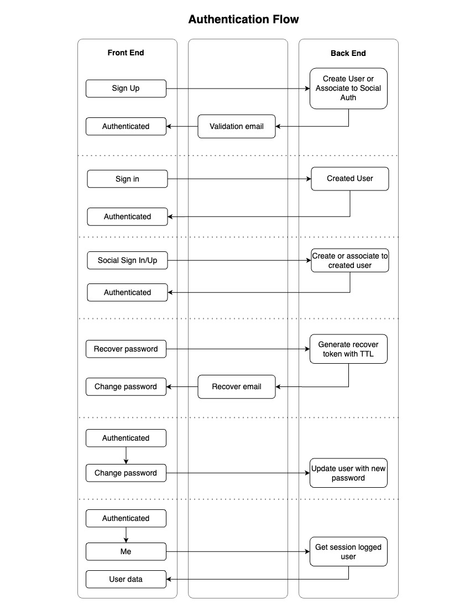

# Feature: Authentication

This document will reflect on how we make a full authentication flow 
with a specified happy path. The main idea it's to establish certain
contracts between back-end and front-end so later an example project
can implement those contracts in their languages.

## Premises

There are some premises that will influence the contracts and the
authentication flow.

- Authentication after user sign in we will be done using a token, instead of cookies.
This token should have an expiration set and it should be refresh when needed.
- For social authentication we will use Firebase as dependency. It handles edge
cases for all social platforms, it centralizes implementation with its SDK for
each language and will not reinvent the wheel.

## Contracts

The contracts of the authentication flow will be divided in each part of the
following flow

>**Important**: Resources marked with 🔒 means that are protected and 
> an **_Authorization: Bearer Token_** header should be sent on the request.
> On the contrary resources marked with 🔓 are not protected, so no special
> header is needed.

- [Simple sign up](contracts/simple_sign_up.md)
- [Simple sign in](contracts/simple_sign_in.md)
- [Simple sign out](contracts/simple_sign_out.md)